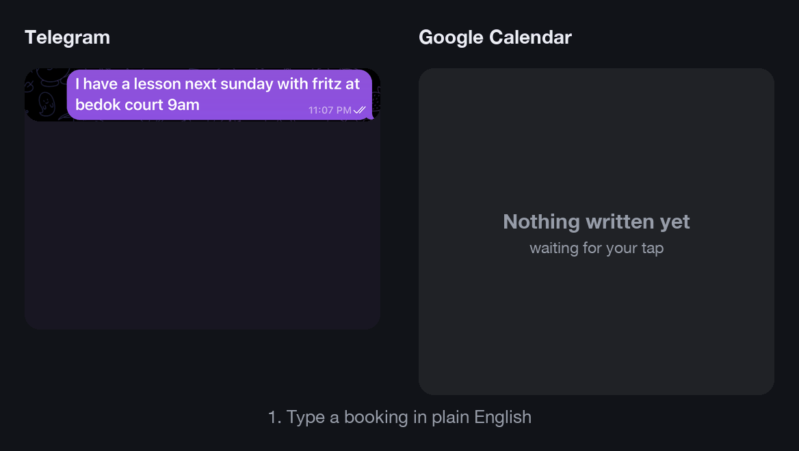
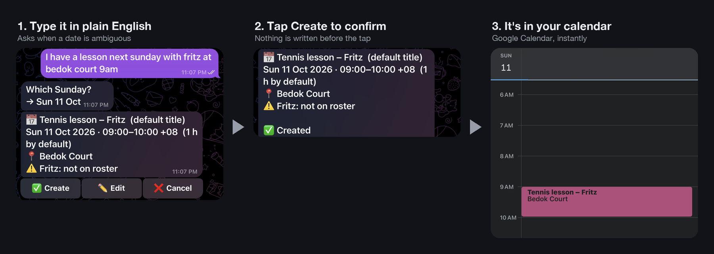

# Booking Buddy: a Telegram calendar assistant that asks before it writes

Text your calendar the way you'd text a person. Booking Buddy is a private Telegram bot that turns messages like
*"tennis lesson next saturday 10am at clearwater condo"* into Google Calendar events. It uses Claude to
understand what you mean, asks when something is genuinely unclear, and **never touches your calendar until
you tap ✅**.

It was built for a tennis coach juggling lessons with students, but works for any appointments.

<p align="center">
  
</p>

---

## What it looks like



The same flow as text, including a follow-up edit:

```
You:  I have an upcoming tennis lesson next saturday 10am at clearwater condo

Bot:  Which Saturday?
      [ Sat 10 Oct ]  [ Sat 17 Oct ]

You:  (taps Sat 17 Oct)

Bot:  📅 Tennis lesson
      Sat 17 Oct 2026 · 10:00–11:00 SGT  (1 h by default)
      📍 Clearwater Condo
      [ ✅ Create ]  [ ✏️ Edit ]  [ ❌ Cancel ]

You:  (taps ✅; the card updates)

Bot:  📅 Tennis lesson
      Sat 17 Oct 2026 · 10:00–11:00 SGT  (1 h by default)
      📍 Clearwater Condo

      ✅ Created
      https://www.google.com/calendar/event?eid=...

You:  actually move it to 11

Bot:  ✏️ Change event
      Before:
        📅 Tennis lesson
        Sat 17 Oct 2026 · 10:00–11:00 SGT
        📍 Clearwater Condo
      After:
        📅 Tennis lesson
        Sat 17 Oct 2026 · 11:00–12:00 SGT
        📍 Clearwater Condo
      [ ✅ Update ]  [ ✏️ Edit ]  [ ❌ Cancel ]
```

## What it can do

- **Plain-language booking.** No commands to learn. Typos and shorthand such as "tmrw 6pm" or "coming sat"
  are fine.
- **Asks when a date is really ambiguous.** "Next Saturday" said on a Sunday could mean either of two days,
  so Booking Buddy asks instead of guessing. Unambiguous phrases like "this coming Saturday" go straight through.
- **Asks for what's missing, once.** A booking needs a date, a time and a place. If any are missing, Booking Buddy
  asks one question covering all of them.
- **Knows your students.** An optional roster maps "wei ling", "WL" or the typo "Priyaa" to the right
  person. It asks if a name matches two students. Names that aren't on the roster still work and are flagged
  on the card.
- **Group lessons.** "for adam and eve" becomes one event titled *Tennis lesson – Adam & Eve*.
- **Per-student defaults.** "lesson tomorrow 5pm for ahmad" can fill in Ahmad's usual court and lesson
  length. The card marks every value it filled in for you.
- **Move, reschedule and cancel.** "push my saturday lesson back an hour", "make it 90 min" or "cancel
  tomorrow's lesson with ahmad". It finds the event, and shows a before/after card for changes or the full
  event for deletions.
- **Conflict warnings.** If a new event overlaps something already in your calendar, the card says so.
- **Lookups.** "what's on this week?"
- **Several events in one message** become separate cards.
- **Recurring lessons.** Weekly lessons with a set number of sessions or an end date.

## Safety by design

Booking Buddy can read and edit your calendar, so it is deliberately restricted:

| Guarantee | How |
|---|---|
| **Nothing is written without your tap** | The AI can only *propose* changes. Bot code, not the model, makes the actual calendar call, and only after you tap ✅. Edits and deletions always need a tap. |
| **Only you can use it** | Every message and button tap is checked against your Telegram user ID. Anyone else gets no reply at all. |
| **The AI has a minimal toolbox** | The model sees only ten calendar and date tools: no shell, files or web access. Startup aborts if anything else appears. |
| **No guessed IDs** | The AI can only edit or delete events it has looked up in the same conversation. |
| **No stale changes** | If an event changed elsewhere after the card was shown, the change is cancelled and you're told why. |
| **Tapping twice is harmless** | Each proposal has a fixed event ID, so a double tap or retry never creates a duplicate. |
| **Calendar text is not trusted** | Event titles and descriptions may come from other people's invites. The AI treats them as data and never follows instructions inside them. |
| **Nobody gets emailed** | Events are never sent as invitations. Student names only appear in the title. |
| **Typo guards** | Times in the past, events more than 2 years ahead, and implausible durations are rejected. |
| **Spending cap** | A daily message limit and a per-message time limit bound API costs. |

## How it works

```
 You (Telegram)
      │  messages and button taps
      ▼
 telegram_app ──── owner check, one conversation at a time, renders cards and buttons
      │
      ▼
 agent ─────────── Claude (Anthropic Messages API) in a tool loop
      │             system prompt + skill playbooks (skills/*/SKILL.md)
      ▼
 tools ─────────── get_now · date_candidates · list_events · get_event · check_conflicts
      │             propose_create_event · propose_update_event · propose_delete_event · ask_user
      ▼
 confirm ───────── stores proposals; on ✅ writes via the calendar backend
      │
      ▼
 Google Calendar API        SQLite: proposals, conversation history, counters
```

A few design choices worth knowing:

- **Dates are computed by code, not by the AI.** Language models are unreliable at weekday arithmetic, so
  `date_candidates` resolves phrases like "next saturday" deterministically. The AI decides whether to ask.
- **Every proposal is validated by schemas.** Pydantic models define what a booking, edit or deletion must
  contain. They generate the tool schemas the model sees and re-check every call in code.
- **Roster matching is deterministic.** Student names are matched in code (exact, prefix, then typo-tolerant),
  not by the model.
- **Conversations survive restarts.** History is stored in SQLite, so a question asked before a restart
  can still be answered after it.
- **Easy to extend.** A new capability is one module in `src/calbot/tools/` plus one
  `skills/<name>/SKILL.md` playbook. The agent core doesn't change.

## Getting started

### Requirements

- Python 3.11+ (developed on 3.13)
- A Telegram account
- An [Anthropic API key](https://console.anthropic.com)
- A Google account with Google Calendar

### 1. Install

```bash
git clone <this repo> && cd <repo>
uv venv --python 3.13 .venv
uv pip install --python .venv/bin/python -e ".[dev]"
cp .env.example .env
```

### 2. Create the Telegram bot

1. Message [@BotFather](https://t.me/BotFather), send `/newbot`, and put the token in `.env` as
   `TELEGRAM_BOT_TOKEN`.
2. Message [@userinfobot](https://t.me/userinfobot) to get your numeric user ID, and set it as
   `OWNER_TELEGRAM_ID`.
3. Set `ANTHROPIC_API_KEY`.

`.env` is git-ignored. Never put real keys in `.env.example`.

### 3. Connect Google Calendar

1. In [Google Cloud Console](https://console.cloud.google.com), create a project and enable the
   **Google Calendar API**.
2. Under **Google Auth Platform**:
   - **Branding:** fill in an app name and your email.
   - **Audience:** choose *External*, and add your Gmail under *Test users*.
   - **Clients:** create a client of type **Desktop app**, download its JSON, and save it as
     `data/client_secret.json`.
3. Run the one-time login. It opens a browser; click through the "unverified app" screen and grant both
   permissions:
   ```bash
   .venv/bin/python scripts/google_auth.py
   ```
4. Recommended: create a separate test calendar first, and put its ID (from *Settings → Integrate
   calendar*) in `.env` as `CALENDAR_ID`.

> **About token expiry:** while the Google app is in *Testing* status, the login expires after 7 days. The
> bot messages you when it does; re-run `scripts/google_auth.py`. To avoid the weekly re-login, publish the
> app (*Audience → Publish app*). Google requires a homepage URL and a privacy policy URL on the Branding
> page first.

The bot only requests two permissions: `calendar.events` (to read and write events) and
`calendar.calendarlist.readonly` (to confirm it can write to the chosen calendar).

### 4. Add your students (optional)

```bash
cp roster.example.json data/roster.json
```

```json
[
  {"name": "Wei Ling Tan", "aliases": ["WL"], "default_location": "Clearwater Condo", "default_duration_min": 60},
  {"name": "Ahmad Rahman", "default_location": "Kallang Court 3", "default_duration_min": 90}
]
```

Only `name` is required. The roster stays in `data/`, which is git-ignored.

### 5. Run

```bash
PYTHONPATH=src .venv/bin/python -m calbot.main
```

Message your bot `/start`. Run exactly one instance per bot token.

#### With Docker

```bash
docker build -t booking-buddy .
docker run -d --name booking-buddy --restart always \
  -v "$PWD/.env:/app/.env:ro" -v "$PWD/data:/app/data" booking-buddy
```

`.env` is mounted rather than passed with `--env-file`, because Docker would keep the inline `# comments`
as part of the values. On Linux, make `data/` writable by the container's user: `sudo chown -R 1000:1000 data`.

Booking Buddy runs this way on a free-tier Google Cloud `e2-micro` VM. To update it after pushing changes:

```bash
git pull && sudo docker build -t booking-buddy . && sudo docker rm -f booking-buddy && <the docker run command above>
```

The bot uses long polling, so it needs only outbound internet access: no public URL, domain or TLS
certificate.

## Bot commands

| Command | What it does |
|---|---|
| `/start`, `/help` | Example messages |
| `/status` | Model, timezone, calendar, Google token health, last successful calendar call |
| `/reset` | Forget the current conversation |

## Configuration

All settings are environment variables (or lines in `.env`).

| Variable | Default | Purpose |
|---|---|---|
| `TELEGRAM_BOT_TOKEN` | required | From @BotFather |
| `OWNER_TELEGRAM_ID` | required | The only user the bot responds to |
| `ANTHROPIC_API_KEY` | required | Claude API key |
| `ANTHROPIC_MODEL` | `claude-sonnet-5-5` | Claude model |
| `ANTHROPIC_EFFORT` | `medium` | Reasoning effort: `low`, `medium` or `high` |
| `CALENDAR_ID` | `primary` | Calendar to read and write |
| `TIMEZONE` | `Asia/Singapore` | Timezone for interpreting and showing times |
| `TIMEZONE_LABEL` | from timezone | Label shown on cards, e.g. `SGT` |
| `DEFAULT_DURATION_MIN` | `60` | Duration when none is given |
| `DEFAULT_EVENT_TITLE` | `Tennis lesson` | Title when none is given |
| `NEXT_WEEKDAY_POLICY` | `ask` | Meaning of "next saturday": `ask`, `upcoming` or `following_week` |
| `CONFIRM_MODE` | `always` | `never` auto-confirms new events (edits and deletes still need a tap) |
| `DAILY_MESSAGE_CAP` | `200` | Maximum messages per day |
| `BACKEND` | `google` | `fake` uses an in-memory calendar, for trying the bot out |
| `REFUSAL_FALLBACK` | `true` | Retry on another Claude model if a request is declined on safety grounds |

## Development

```bash
.venv/bin/python -m pytest                              # unit tests, no network needed
RUN_EVALS=1 .venv/bin/python -m pytest tests/evals -v   # scripted conversations against the real model
.venv/bin/python scripts/chat.py                        # chat in the terminal with a fake calendar
```

- **Unit tests** cover date resolution (across month, year and leap-year boundaries), schemas, roster
  matching, the confirm flow (double taps, expiry, stale events, invented IDs) and the Telegram handlers.
- **Evals** run real conversations with a frozen clock and an in-memory calendar. Examples: "next saturday"
  asks, a group booking produces one event, an ambiguous student name triggers a question, and an
  instruction hidden in an event description is ignored. They make real API calls, so they cost money.
  Re-run them after changing the prompt, skills or model.

### Project layout

```
src/calbot/
  main.py            wiring and startup checks
  telegram_app.py    Telegram handlers, cards, buttons
  agent.py           Claude tool loop
  prompts.py         system prompt + skill loading
  tools/             tools the model can call (registry = allowlist)
  confirm.py         proposal lifecycle and commit
  schemas.py         Pydantic action models
  dates.py           deterministic date resolution
  roster.py          student name matching
  store.py           SQLite state
  backends/          Google Calendar API + in-memory fake
skills/              playbooks loaded into the system prompt
scripts/             google_auth.py (one-time login), chat.py (terminal REPL)
tests/               unit/ and evals/
spec.md              full design spec
```

## Roadmap

- Publish the Google app so the login doesn't expire weekly
- "Add to roster" button for new students
- Changing a single occurrence of a recurring lesson
- Venue aliases ("clearwater" → "Clearwater Condo")
- More capabilities through the tool and skill system (e.g. reminders, Google Tasks)

## Built with

[Claude](https://www.anthropic.com/claude) (Anthropic Messages API) ·
[python-telegram-bot](https://python-telegram-bot.org) ·
[Google Calendar API](https://developers.google.com/workspace/calendar) ·
[Pydantic](https://docs.pydantic.dev)
